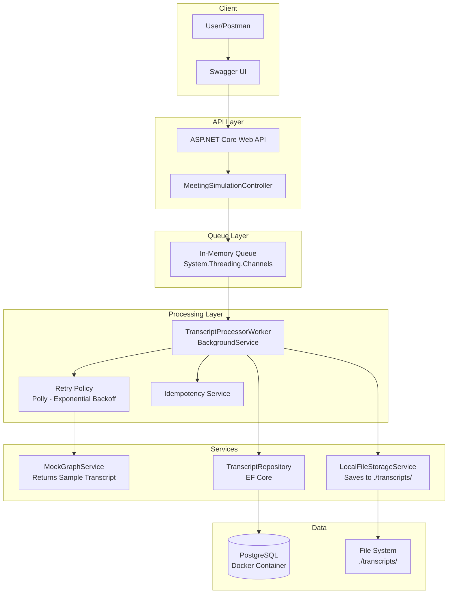
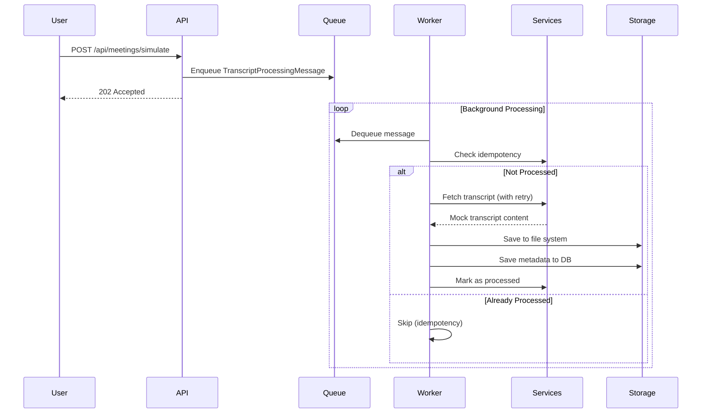
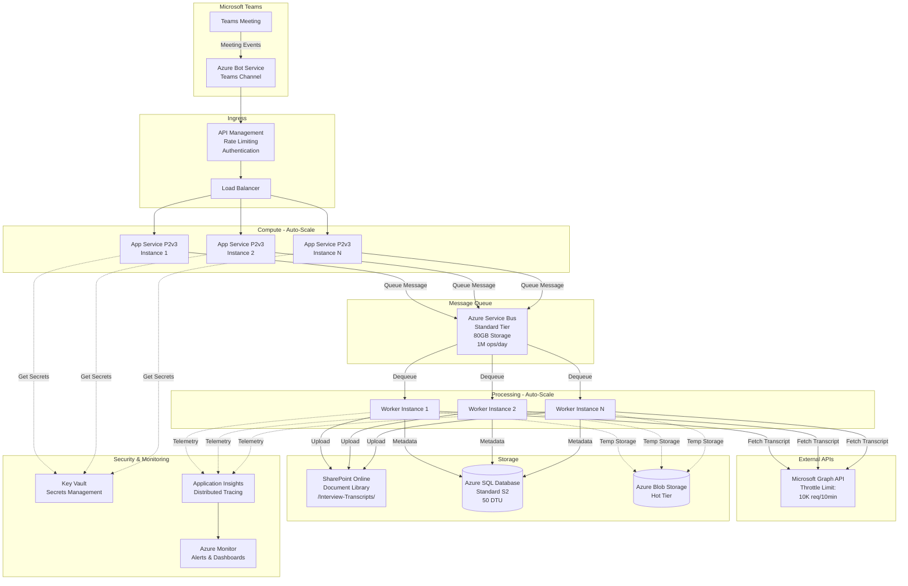
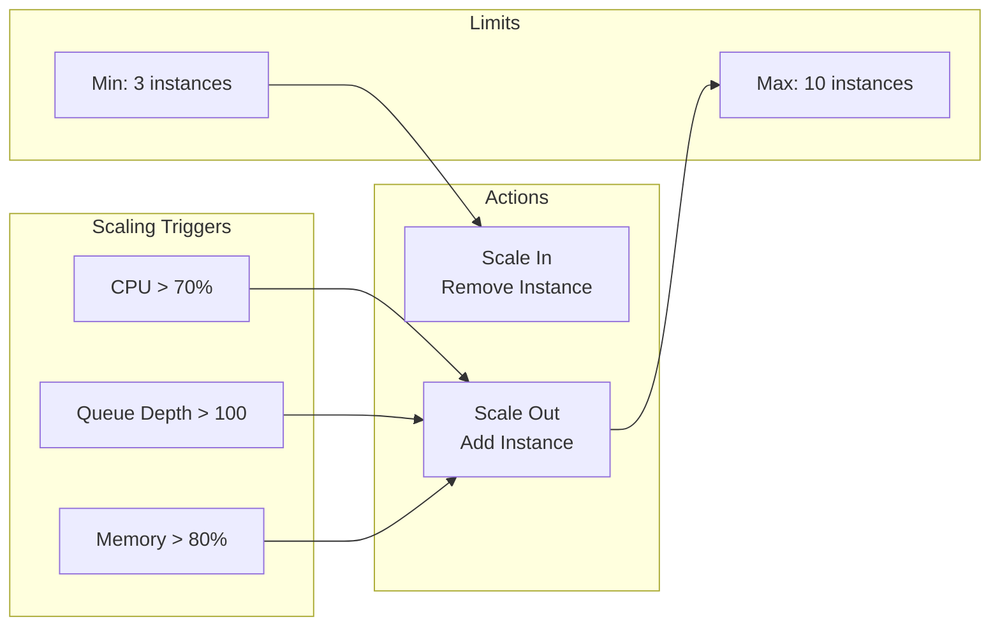
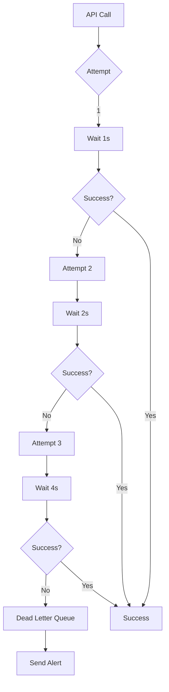
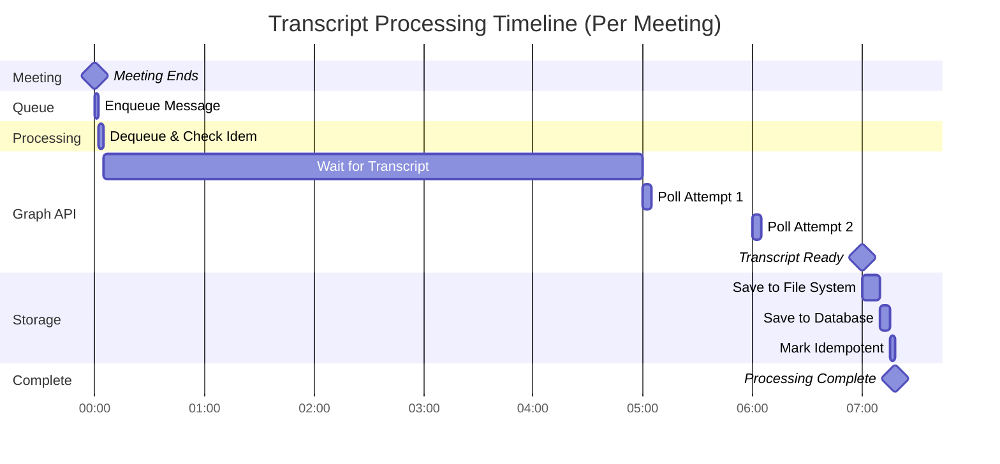
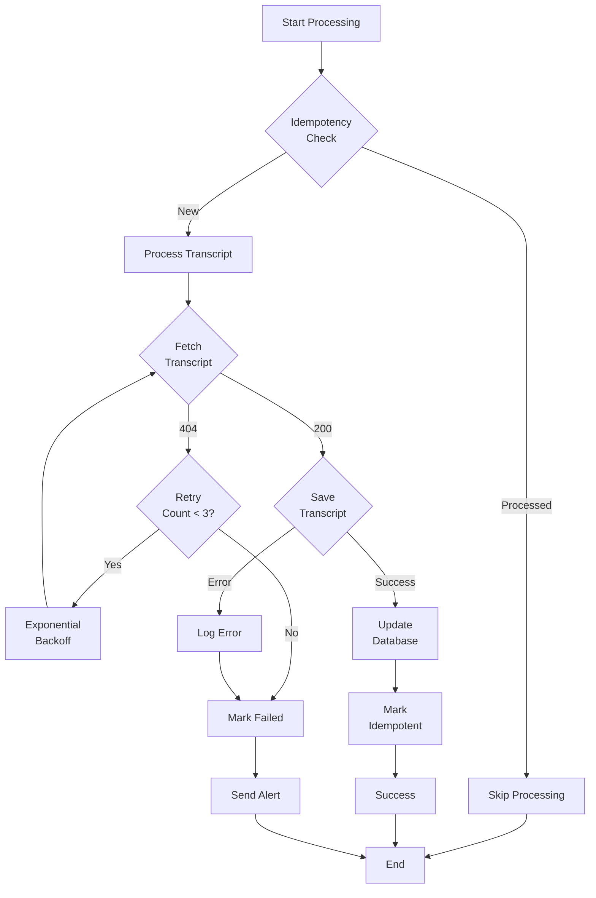
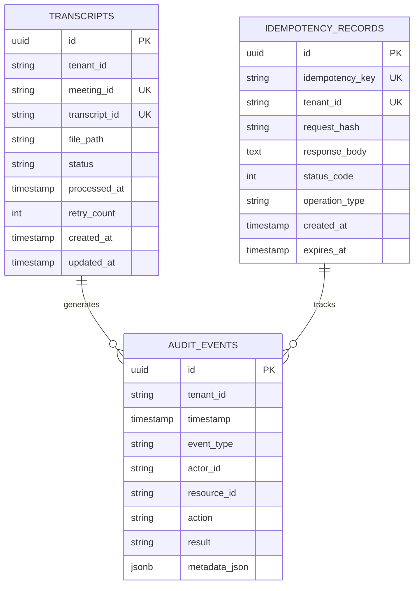
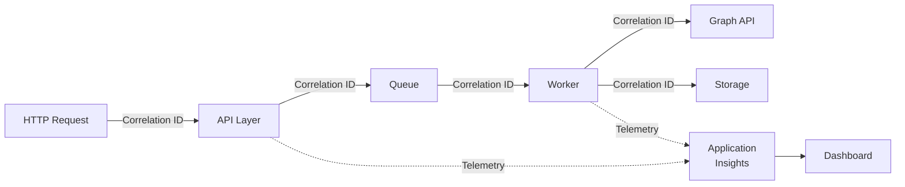
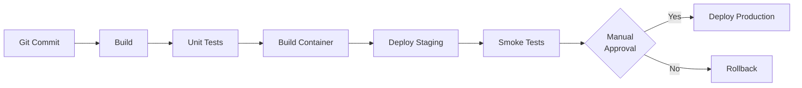

# System Architecture

## Table of Contents

1. [Local Implementation](#local-implementation)
2. [Production Cloud Design](#production-cloud-design)
3. [Scalability Strategy](#scalability-strategy)
4. [Processing Pipeline](#processing-pipeline)
5. [Storage Architecture](#storage-architecture)

---

## Local Implementation

### Component Diagram



### Data Flow



---

## Production Cloud Design

### Azure Architecture for 10,000 Meetings/Day


---

## Scalability Strategy

### Capacity Planning for 10,000 Meetings/Day

**Throughput Analysis:**
- **Daily**: 10,000 meetings
- **Peak hour**: ~600 meetings (8-hour workday, 20% peak factor)
- **Per minute (peak)**: ~10 meetings
- **Processing time**: 5-15 minutes per transcript (including delay)

### Auto-Scaling Configuration



### Resource Sizing

| Component | Size | Justification |
|-----------|------|---------------|
| **App Service** | P2v3 (2 cores, 8GB) | Handles 200 req/hour per instance |
| **Service Bus** | Standard Tier | 80GB storage, 1M operations/day |
| **SQL Database** | Standard S2 (50 DTU) | ~1000 transactions/min |
| **Workers** | 5 instances | 120 meetings/hour each = 600/hour total |

### Retry Strategy



**Configuration:**
- **Max Retries**: 3
- **Backoff**: Exponential (1s, 2s, 4s)
- **Timeout**: 30 seconds per attempt
- **Circuit Breaker**: Opens after 5 consecutive failures

---

## Processing Pipeline

### Transcript Processing Timeline



### Error Handling Flow



---

## Storage Architecture

### Database Schema



### File Storage Structure

```
SharePoint: /Interview-Transcripts/
├── {meeting-id-1}/
│   └── transcript_20260401120000.txt
├── {meeting-id-2}/
│   └── transcript_20260401120100.txt
└── {meeting-id-n}/
    └── transcript_YYYYMMDDHHMMSS.txt
```

**Local equivalent:**
```
./transcripts/
├── test-meeting-001/
│   └── transcript_20260401120000.txt
└── test-meeting-002/
    └── transcript_20260401120100.txt
```

---

## Monitoring & Observability

### Key Metrics

| Metric | Threshold | Alert |
|--------|-----------|-------|
| **Processing Success Rate** | < 95% | Critical |
| **Average Processing Time** | > 10 min | Warning |
| **Queue Depth** | > 100 messages | Warning |
| **Database Connection Pool** | > 80% | Warning |
| **API Response Time** | > 2s | Warning |
| **Failed Retries** | > 5/min | Critical |

### Distributed Tracing



---

## Deployment Strategy

### Infrastructure as Code (Bicep)

```bicep
// Example resource deployment
resource botService 'Microsoft.BotService/botServices@2022-09-15' = {
  name: 'exterview-bot'
  location: 'global'
  sku: {
    name: 'S1'
  }
  properties: {
    displayName: 'ExterView Assessment Bot'
    endpoint: 'https://exterview-api.azurewebsites.net/api/messages'
    msaAppId: botAppId
  }
}

resource serviceBus 'Microsoft.ServiceBus/namespaces@2022-10-01-preview' = {
  name: 'exterview-sb'
  location: location
  sku: {
    name: 'Standard'
    tier: 'Standard'
  }
}

resource appService 'Microsoft.Web/sites@2022-09-01' = {
  name: 'exterview-api'
  location: location
  properties: {
    serverFarmId: appServicePlan.id
    siteConfig: {
      numberOfWorkers: 3
      minTlsVersion: '1.2'
      alwaysOn: true
    }
  }
}
```

### CI/CD Pipeline



---

## Migration Path: Local to Production

### Phase 1: Infrastructure Setup
1. Provision Azure resources (Bicep/Terraform)
2. Configure networking and security
3. Set up Key Vault with secrets
4. Deploy databases with migrations

### Phase 2: Application Deployment
1. Build and push Docker containers
2. Deploy to App Service
3. Configure auto-scaling rules
4. Set up Application Insights

### Phase 3: Bot Registration
1. Register bot with Azure Bot Service
2. Configure Teams channel
3. Test bot in Teams environment
4. Enable production endpoint

### Phase 4: Validation
1. Run integration tests
2. Load test with 600 meetings/hour
3. Verify monitoring and alerts
4. Document runbooks

---

## Cost Estimation (Azure)

| Service | SKU | Monthly Cost (USD) |
|---------|-----|-------------------|
| App Service (P2v3 x3) | P2v3 | $510 |
| Service Bus | Standard | $10 |
| Azure SQL Database | S2 | $150 |
| SharePoint Online | Included in M365 | - |
| Application Insights | Pay-as-you-go | $50 |
| **Total** | | **~$720/month** |

---

This architecture demonstrates understanding of:
- ✅ Distributed systems design
- ✅ Async processing patterns
- ✅ Scalability and auto-scaling
- ✅ Reliability and retry logic
- ✅ Monitoring and observability
- ✅ Cloud-native architecture
