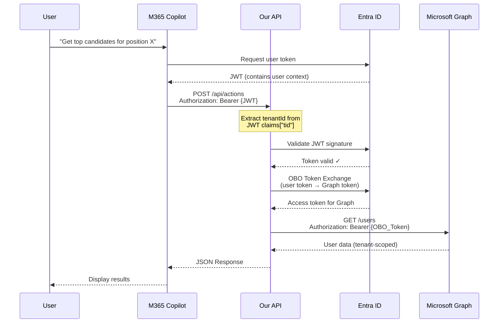

# Technical Explanation

This document provides detailed explanations for Parts 2-5 of the assessment, covering Copilot actions, identity/security, system design, and data integrity.

---

## Table of Contents

1. [Part 2: Copilot Actions Design](#part-2-copilot-actions-design)
2. [Part 3: Identity, Security & Tenant Isolation](#part-3-identity-security--tenant-isolation)
3. [Part 4: System Design](#part-4-system-design)
4. [Part 5: Data Integrity & Audit](#part-5-data-integrity--audit)

---

## Part 2: Copilot Actions Design

### Overview

M365 Copilot actions allow users to interact with business data through natural language. Our implementation provides two actions: a **read action** (`getTopCandidates`) and a **write action** (`scheduleInterview`).

### Action 1: Read Action - GetTopCandidates

**Purpose:** Retrieve top candidates for a given position

**Schema:** [copilot-actions/action-definitions.json](copilot-actions/action-definitions.json)

**Key Design Decisions:**

1. **JSON Schema (Draft-07)**: Industry standard for API contracts
   - Enables automatic validation
   - Self-documenting
   - Tool support in IDEs

2. **Parameters:**
   - `positionId` (required): Identifies the position
   - `limit` (optional, 1-50, default 10): Prevents overload
   - `sortBy` (enum): Explicit sorting options

3. **Response Structure:**
```json
{
  "status": "success",
  "data": {
    "candidates": [
      {
        "candidateId": "cand-12345",
        "name": "John Doe",
        "score": 95,
        "experience": "8 years",
        "matchPercentage": 92,
        "skills": ["C#", ".NET", "Azure"]
      }
    ],
    "total": 5,
    "positionId": "pos-2024-001"
  }
}
```

**Why This Works:**
- Stateless and cacheable
- No side effects (safe to retry)
- Clear filtering and sorting
- Bounded result set (1-50 limit)

### Action 2: Write Action - ScheduleInterview

**Purpose:** Schedule an interview with a candidate (requires confirmation)

**Key Design Decisions:**

1. **Confirmation Gate**: Prevents accidental scheduling
   ```json
   {
     "confirmation": {
       "required": true,
       "message": "Schedule interview with John Doe on Apr 15?"
     }
   }
   ```

2. **Idempotency Key**: Prevents duplicate operations
   - Client-generated UUID
   - Stored in database for 24 hours
   - Same key = same result (no duplicate interviews)

3. **Validation Rules:**
   - `candidateId`: Must match pattern `^cand-[0-9]+$`
   - `interviewDateTime`: ISO 8601 format
   - `durationMinutes`: 15-240 minutes (reasonable range)
   - `interviewerEmails`: 1-10 emails (practical limit)

**Confirmation Flow:**

```
1. User Request → API
   ↓
2. API validates and returns confirmation prompt
   {
     "status": "confirmation_required",
     "confirmationId": "conf-abc123",
     "message": "Schedule interview with John Doe?",
     "expiresAt": "2026-04-01T12:05:00Z"
   }
   ↓
3. User confirms → API
   {
     "confirmationId": "conf-abc123",
     "confirmed": true
   }
   ↓
4. API executes action
   - Checks idempotency key
   - Creates calendar event (Graph API)
   - Returns meeting link
```

**Why Confirmation is Critical:**
- Prevents accidental scheduling
- Gives user chance to review details
- Complies with best practices for write operations
- Confirmation expires after 5 minutes (security)

### Idempotency Implementation

**Pattern:**
1. Client generates UUID as idempotency key
2. Server checks if key exists in database
3. If exists: Return cached response (no reprocessing)
4. If not: Execute operation and store result

**Database Table:**
```sql
CREATE TABLE idempotency_records (
    id UUID PRIMARY KEY,
    idempotency_key VARCHAR(100) NOT NULL,
    tenant_id VARCHAR(100) NOT NULL,
    response_body TEXT,
    status_code INT,
    operation_type VARCHAR(100),
    created_at TIMESTAMP,
    expires_at TIMESTAMP, -- TTL: 24 hours
    UNIQUE (idempotency_key, tenant_id)
);
```

**Benefits:**
- Network failures don't cause duplicates
- Client can safely retry
- 24-hour retention balances storage and safety

### Request Validation

**Implementation:**
```csharp
public class JsonSchemaValidator
{
    public bool Validate(JObject request, JSchema schema)
    {
        return request.IsValid(schema, out IList<string> errors);
    }
}
```

**Validation Levels:**
1. **Schema Level**: JSON Schema validates structure
2. **Business Logic**: Domain-specific rules
3. **Authorization**: User permissions (JWT claims)

---

## Part 3: Identity, Security & Tenant Isolation

### Authentication Flow



### JWT Validation

**Where:** ASP.NET Core authentication middleware (executes before controllers)

**Configuration:**
```csharp
services.AddAuthentication(JwtBearerDefaults.AuthenticationScheme)
    .AddMicrosoftIdentityWebApi(options =>
    {
        options.TokenValidationParameters = new TokenValidationParameters
        {
            ValidateIssuer = true,
            ValidateAudience = true,
            ValidateLifetime = true,
            ValidateIssuerSigningKey = true,
            ValidIssuers = new[] {
                "https://login.microsoftonline.com/{tenantId}/v2.0"
            },
            ValidAudiences = new[] { Configuration["AzureAd:ClientId"] },
            ClockSkew = TimeSpan.FromMinutes(5)
        };
    });
```

**What Gets Validated:**
1. **Signature**: Cryptographic verification using public key from Entra ID
2. **Issuer**: Must be `login.microsoftonline.com/{tenantId}`
3. **Audience**: Must match our application's Client ID
4. **Expiration**: Token must not be expired (with 5-min clock skew)
5. **Not Before**: Token must be active

**JWT Claims Extracted:**
```json
{
  "tid": "tenant-id-guid",      // Tenant ID (CRITICAL)
  "oid": "user-object-id",      // User ID
  "upn": "user@company.com",    // User Principal Name
  "roles": ["Admin", "User"],   // Application roles
  "scp": "read write",          // Scopes
  "iat": 1234567890,            // Issued at
  "exp": 1234571490             // Expires at
}
```

### Tenant Isolation Strategy

**Critical Security Pattern:**

```csharp
public class TenantIsolationMiddleware
{
    public async Task InvokeAsync(HttpContext context)
    {
        // CRITICAL: Extract tenantId from JWT, NOT from request body
        var tenantId = context.User.FindFirst("tid")?.Value;

        if (string.IsNullOrEmpty(tenantId))
        {
            context.Response.StatusCode = 401;
            await context.Response.WriteAsync("Missing tenant claim");
            return;
        }

        // Store for downstream use
        context.Items["TenantId"] = tenantId;

        // Validate tenant is authorized
        if (!await _tenantService.IsAuthorizedAsync(tenantId))
        {
            context.Response.StatusCode = 403;
            await context.Response.WriteAsync("Tenant not authorized");
            return;
        }

        await _next(context);
    }
}
```

**Why This Prevents Cross-Tenant Leakage:**

1. **Source of Truth**: JWT is cryptographically signed by Entra ID
   - Cannot be tampered with
   - Tenant ID is guaranteed correct

2. **Never Trust Request Body**: User could send fake tenantId in payload
   ```json
   // BAD - Don't do this!
   {
     "tenantId": "fake-tenant-123",  // User can fake this
     "action": "getTopCandidates"
   }
   ```

3. **Database Queries**: Always filter by JWT tenantId
   ```csharp
   var candidates = await _context.Candidates
       .Where(c => c.TenantId == jwtTenantId)  // From JWT, not request
       .ToListAsync();
   ```

4. **Partition Key**: Use tenantId as partition key in Cosmos DB
   - Physical isolation of data
   - Better performance
   - Additional security layer

### On-Behalf-Of (OBO) Token Exchange

**Purpose:** Call Microsoft Graph on behalf of the user (not as the application)

**Flow:**
```csharp
public class GraphClientFactory
{
    public async Task<GraphServiceClient> CreateClientAsync(string userToken)
    {
        var credential = new OnBehalfOfCredential(
            tenantId: _configuration["AzureAd:TenantId"],
            clientId: _configuration["AzureAd:ClientId"],
            clientSecret: await _keyVault.GetSecretAsync("ClientSecret"),
            userAssertion: userToken
        );

        return new GraphServiceClient(credential);
    }
}
```

**HTTP Request to Entra ID:**
```http
POST https://login.microsoftonline.com/{tenant}/oauth2/v2.0/token
Content-Type: application/x-www-form-urlencoded

grant_type=urn:ietf:params:oauth:grant-type:jwt-bearer
&client_id={client-id}
&client_secret={client-secret}
&assertion={user-jwt-token}
&scope=https://graph.microsoft.com/.default
&requested_token_use=on_behalf_of
```

**Response:**
```json
{
  "access_token": "eyJ0eXAiOi...",  // New token for Graph
  "token_type": "Bearer",
  "expires_in": 3600,
  "scope": "User.Read Calendars.ReadWrite"
}
```

**Why OBO is Critical:**
- **User Context**: Graph API calls are scoped to user's permissions
- **Audit Trail**: Actions logged as performed by specific user
- **Consent**: User explicitly consents to app accessing their data
- **Security**: App never has blanket access to all user data

### Permission Model

| Operation | Permission Type | Scopes | Justification |
|-----------|----------------|--------|---------------|
| **Bot joins meeting** | Application | `OnlineMeetings.ReadWrite.All` | Bot acts autonomously, not on behalf of user |
| **Fetch transcript** | Application | `CallRecords.Read.All` | System-level access to call records |
| **Upload to SharePoint** | Delegated (OBO) | `Sites.ReadWrite.All` | User's SharePoint site, user context required |
| **Read candidates** | Delegated (OBO) | Custom scope | User must have permission to view candidates |
| **Schedule interview** | Delegated (OBO) | `Calendars.ReadWrite` | Creates event in user's calendar |

**Delegated vs Application Permissions:**

- **Delegated**: User context, user must consent, respects user permissions
  - Use for: Actions on user's behalf (read mail, create event)

- **Application**: App context, admin consent, full access
  - Use for: Background jobs, system operations

### Secrets Management

**Production Approach:**

1. **Azure Key Vault**: All secrets stored in Key Vault
   ```csharp
   var keyVaultUrl = _configuration["KeyVault:VaultUri"];
   var client = new SecretClient(
       new Uri(keyVaultUrl),
       new DefaultAzureCredential()  // Managed Identity
   );
   var secret = await client.GetSecretAsync("ClientSecret");
   ```

2. **Managed Identity**: App authenticates to Key Vault without credentials
   - No secrets in code or config files
   - Automatic credential rotation
   - Azure handles authentication

3. **Configuration References:**
   ```json
   {
     "AzureAd": {
       "ClientSecret": "@Microsoft.KeyVault(SecretUri=https://myvault.vault.azure.net/secrets/ClientSecret/)"
     }
   }
   ```

4. **Secret Rotation Policy:**
   - Rotate every 90 days
   - Automated alerts 30 days before expiration
   - Zero-downtime rotation (Key Vault supports versions)

**Never Store Secrets In:**
- ❌ Source code
- ❌ Configuration files (committed to Git)
- ❌ Environment variables (in production)
- ❌ Database
- ❌ Logs

---

## Part 4: System Design

### Scalability for 10,000 Meetings/Day

**Throughput Calculation:**
- **Daily**: 10,000 meetings
- **Hourly (average)**: 10,000 / 24 = ~417 meetings/hour
- **Peak hour** (20% factor): ~600 meetings/hour
- **Per minute (peak)**: 10 meetings/min

**Processing Time:**
- Transcript delay: 5-10 minutes after meeting
- Processing: 5-10 seconds
- **Total**: ~10-15 minutes per transcript

### Architecture Components

**1. Load Balancing:**
- Azure Load Balancer distributes requests
- Health checks every 30 seconds
- Round-robin or least-connections algorithm

**2. Auto-Scaling:**
```yaml
triggers:
  - type: cpu
    threshold: 70%
    action: scale-out
  - type: queue-depth
    threshold: 100
    action: scale-out
  - type: memory
    threshold: 80%
    action: scale-out

rules:
  min-instances: 3
  max-instances: 10
  scale-out-cooldown: 5min
  scale-in-cooldown: 10min
```

**3. Message Queue (Service Bus):**
- **Decouples** API from processing
- **Resilience**: If workers crash, messages remain
- **Throttling**: Prevents overload
- **Ordering**: FIFO guarantee (if needed)

**4. Background Workers:**
- **5 instances** in production
- Each handles ~120 meetings/hour
- Total capacity: 600 meetings/hour (peak)

### Async Processing Benefits

**Without Queue (Synchronous):**
```
User Request → API → Graph API (10s delay) → Response
                        ↓
                   User waits 10+ seconds
                   Connection might timeout
```

**With Queue (Asynchronous):**
```
User Request → API → Queue → 202 Accepted (instant)
                       ↓
                   Worker processes in background
                   User doesn't wait
```

**Benefits:**
1. **Responsiveness**: API returns immediately
2. **Reliability**: Retries on failure
3. **Scalability**: Workers scale independently
4. **Backpressure**: Queue absorbs traffic spikes

### Retry Strategy

**Exponential Backoff:**
```
Attempt 1: Immediate
Attempt 2: Wait 1 second
Attempt 3: Wait 2 seconds
Attempt 4: Wait 4 seconds
Attempt 5: Wait 8 seconds
Max: 5 attempts, then dead-letter queue
```

**Implementation (Polly):**
```csharp
var retryPolicy = Policy
    .Handle<HttpRequestException>()
    .Or<TimeoutException>()
    .WaitAndRetryAsync(
        retryCount: 5,
        sleepDurationProvider: attempt =>
            TimeSpan.FromSeconds(Math.Pow(2, attempt - 1)),
        onRetry: (exception, timeSpan, retryCount, context) =>
        {
            _logger.LogWarning(
                "Retry {RetryCount}/5 after {Delay}s: {Error}",
                retryCount, timeSpan.TotalSeconds, exception.Message
            );
        }
    );
```

**Circuit Breaker Pattern:**
```csharp
var circuitBreaker = Policy
    .Handle<HttpRequestException>()
    .CircuitBreakerAsync(
        exceptionsAllowedBeforeBreaking: 5,
        durationOfBreak: TimeSpan.FromMinutes(2),
        onBreak: (ex, duration) =>
            _logger.LogError("Circuit breaker opened for {Duration}", duration),
        onReset: () =>
            _logger.LogInformation("Circuit breaker reset")
    );
```

### Monitoring Strategy

**Key Metrics:**
1. **Throughput**: Meetings processed per hour
2. **Latency**: P50, P95, P99 processing times
3. **Error Rate**: Failed processes / total
4. **Queue Depth**: Messages waiting
5. **Resource Usage**: CPU, memory, connections

**Alerts:**
- Success rate < 95%: Page on-call engineer
- Queue depth > 100: Warning
- Processing time > 15 min: Investigation
- Circuit breaker open: Critical

**Distributed Tracing:**
```csharp
using var activity = _activitySource.StartActivity("ProcessTranscript");
activity?.SetTag("meeting.id", meetingId);
activity?.SetTag("tenant.id", tenantId);
```

Application Insights automatically:
- Correlates requests across services
- Tracks dependencies (DB, external APIs)
- Builds end-to-end trace

---

## Part 5: Data Integrity & Audit

### Idempotency Implementation

**Problem Without Idempotency:**
```
User clicks "Schedule Interview"
  → Network timeout
  → User clicks again
  → TWO interviews scheduled! ❌
```

**Solution:**
```csharp
public async Task<IActionResult> ScheduleInterview(
    ScheduleInterviewRequest request)
{
    // Check if already processed
    var (exists, record) = await _idempotencyService
        .CheckAsync(request.IdempotencyKey, tenantId);

    if (exists)
    {
        // Return cached response (no reprocessing)
        return Ok(JsonSerializer.Deserialize(record.ResponseBody));
    }

    // Process the request
    var result = await _interviewService.ScheduleAsync(request);

    // Store result with idempotency key
    await _idempotencyService.StoreAsync(
        request.IdempotencyKey,
        tenantId,
        JsonSerializer.Serialize(result),
        200
    );

    return Ok(result);
}
```

**Key Properties:**
1. **Deterministic**: Same input → Same output
2. **Time-bounded**: Keys expire after 24 hours
3. **Tenant-scoped**: Idempotency per tenant
4. **Request hashing**: Validates request didn't change

### Audit Logging

**Append-Only Pattern:**
```csharp
public class AuditLogger
{
    public async Task LogAsync(AuditEvent auditEvent)
    {
        // ONLY CreateAsync allowed (no Update/Delete)
        await _context.AuditEvents.AddAsync(auditEvent);
        await _context.SaveChangesAsync();
    }

    // NO UPDATE METHOD
    // NO DELETE METHOD
}
```

**Audit Event Structure:**
```json
{
  "id": "uuid",
  "tenantId": "tenant-123",
  "timestamp": "2026-04-01T12:00:00Z",
  "eventType": "InterviewScheduled",
  "actorId": "user-456",
  "actorType": "User",
  "resourceId": "interview-789",
  "resourceType": "Interview",
  "action": "Create",
  "result": "Success",
  "metadata": {
    "candidateId": "cand-123",
    "interviewDateTime": "2026-04-15T14:00:00Z"
  },
  "correlationId": "request-abc-123"
}
```

**What Gets Audited:**
- User authentication events
- API requests
- Data mutations (create, update, delete)
- Permission changes
- Errors and exceptions

**Retention Policy:**
- **Hot storage**: 90 days (Cosmos DB)
- **Warm storage**: 1 year (Azure Blob - Cool tier)
- **Cold storage**: 7 years (Azure Blob - Archive tier)

**Compliance:**
- GDPR: Support data export/deletion requests
- SOC 2: Audit trail for all changes
- HIPAA: Encrypted at rest and in transit

### Data Integrity Patterns

**1. Database Constraints:**
```sql
-- Prevent duplicate transcripts
ALTER TABLE transcripts
ADD CONSTRAINT uq_meeting_transcript
UNIQUE (meeting_id, transcript_id);

-- Prevent duplicate idempotency keys
ALTER TABLE idempotency_records
ADD CONSTRAINT uq_idempotency_key
UNIQUE (idempotency_key, tenant_id);
```

**2. Transactions:**
```csharp
using var transaction = await _context.Database.BeginTransactionAsync();
try
{
    await _context.Transcripts.AddAsync(metadata);
    await _context.AuditEvents.AddAsync(auditEvent);
    await _context.SaveChangesAsync();
    await transaction.CommitAsync();
}
catch
{
    await transaction.RollbackAsync();
    throw;
}
```

**3. Optimistic Concurrency:**
```csharp
public class TranscriptMetadata
{
    [Timestamp]
    public byte[] RowVersion { get; set; }
}

try
{
    _context.Update(metadata);
    await _context.SaveChangesAsync();
}
catch (DbUpdateConcurrencyException)
{
    // Handle conflict: reload and retry
}
```

---

## Summary

This implementation demonstrates:

✅ **Part 2 - Copilot Actions**
- JSON Schema (Draft-07) validation
- Read vs Write action patterns
- Confirmation gate for write operations
- Idempotency for reliability

✅ **Part 3 - Security**
- JWT validation in middleware
- Tenant isolation via JWT claims
- OBO token exchange for Graph API
- Secrets in Azure Key Vault

✅ **Part 4 - System Design**
- Scalability to 10K meetings/day
- Async processing with message queue
- Retry logic and circuit breakers
- Auto-scaling and monitoring

✅ **Part 5 - Data Integrity**
- Idempotency prevents duplicates
- Append-only audit logging
- Database constraints
- Distributed tracing

---

*This explanation document is part of the ExterView Assessment submission. See [ARCHITECTURE.md](ARCHITECTURE.md) for system diagrams and [README-SOLUTION.md](README-SOLUTION.md) for setup instructions.*
